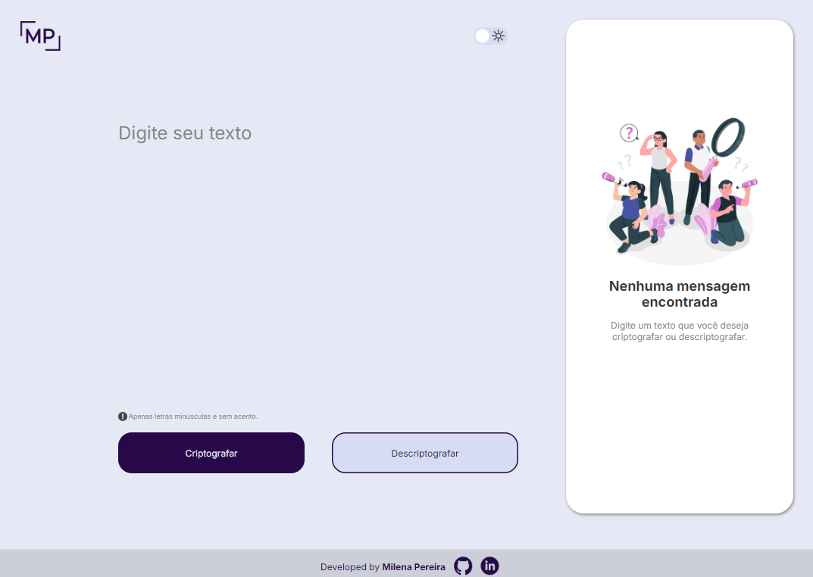
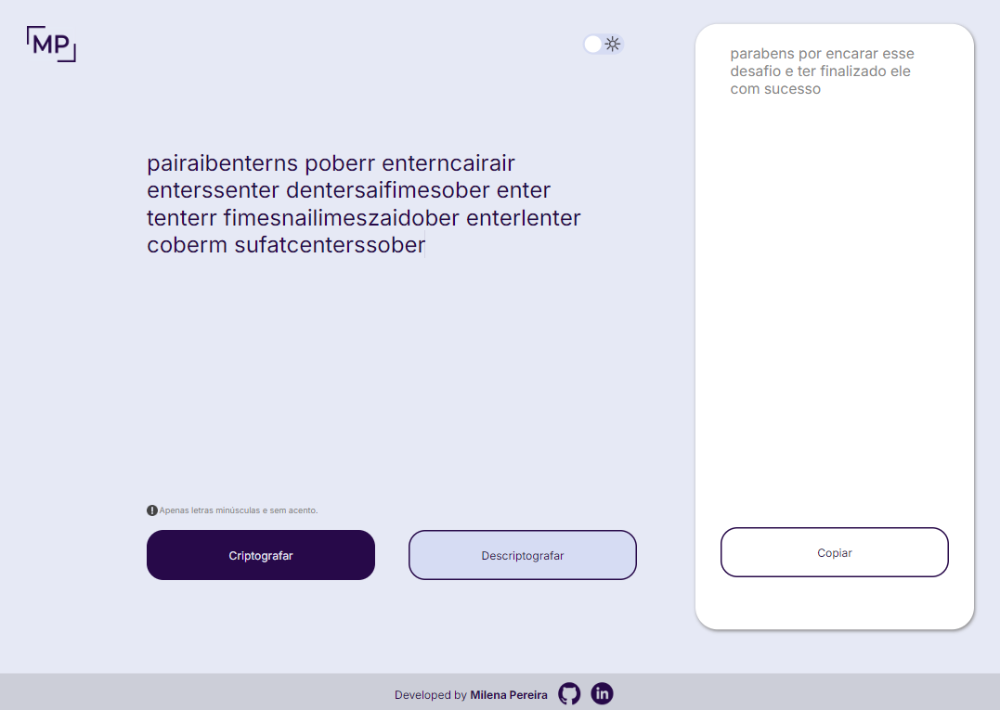
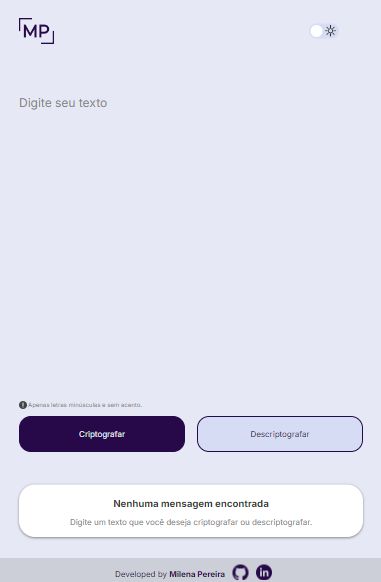
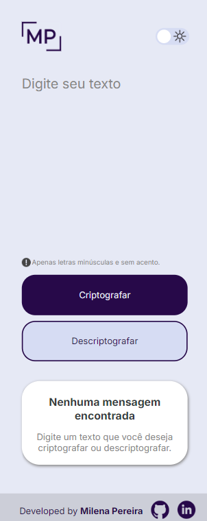
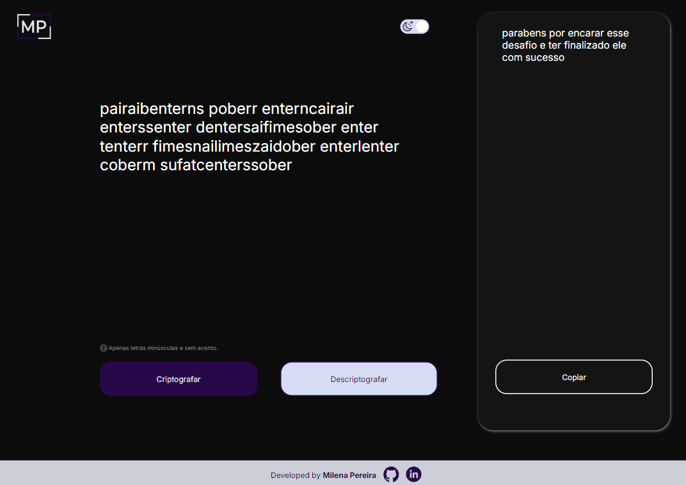

# Text Encryption Application

  
  

## Description

An application that encrypts texts, allowing the exchange of secret messages with others who have the application or know the encryption key used. The application works only with lowercase letters, without accents and special characters. It is possible to convert a word into its encrypted version and also revert an encrypted word back to its original form.

## Features

- **Encrypt Text:** Enter text to encrypt and see the result.  
- **Decrypt Text:** Enter the encrypted text to see the original text.  
- **Copy Text:** Copy the encrypted/decrypted text to the clipboard with one click.  

## Technologies Used

- **HTML**  
- **CSS**  
- **JavaScript**  

## Responsiveness

The application was developed to be responsive, following the FIGMA prototype, ensuring a consistent user experience across different devices, such as desktops, tablets, and smartphones.  

  
  

## Accessibility

To provide a better user experience, the application supports dark mode. This feature is especially useful for people with visual sensitivities or those who prefer lower-brightness interfaces.  

  
  

## Learn More
Access: [https://decodificador-de-texto-beryl-delta.vercel.app/](https://decodificador-de-texto-beryl-delta.vercel.app/)

***
# Aplicação de Criptografia de Textos
 

  
  

 
## Descrição
 
Aplicação que criptografa textos, permitindo a troca de mensagens secretas com outras pessoas que disponham da aplicação ou saibam o segredo da criptografia utilizada. A aplicação funciona apenas com letras minúsculas, sem acentos e sem caracteres especiais. É possível converter uma palavra para a versão criptografada e também retornar uma palavra criptografada para a versão original.
 
## Funcionalidades
 
- **Criptografar Texto:** Insira o texto para criptografar e veja o resultado.
- **Descriptografar Texto:** Insira o texto criptografado para ver o texto original.
- **Copiar Texto:** Copie o texto criptografado/descriptografado para a área de transferência com um clique.
 
## Tecnologias Utilizadas
 
- **HTML**
- **CSS**
- **JavaScript**
 
## Responsividade
 
A aplicação foi desenvolvida para ser responsiva, conforme protótipo FIGMA, permitibdo que a experiência da pessoa usuária seja consistente em diferentes dispositivos, como desktops, tablets e smartphones.
 

  

## Acessibilidade

Com o objetivo de permitir uma melhor experiênciada pessoa usuária, a aplicação oferece suporte ao modo escuro (dark mode). Essa funcionalidade é especialmente útil para pessoas com sensibilidades visuais ou que preferem interfaces com menor brilho.

  

## Para conhecer mais
Acesse: https://decodificador-de-texto-beryl-delta.vercel.app/
